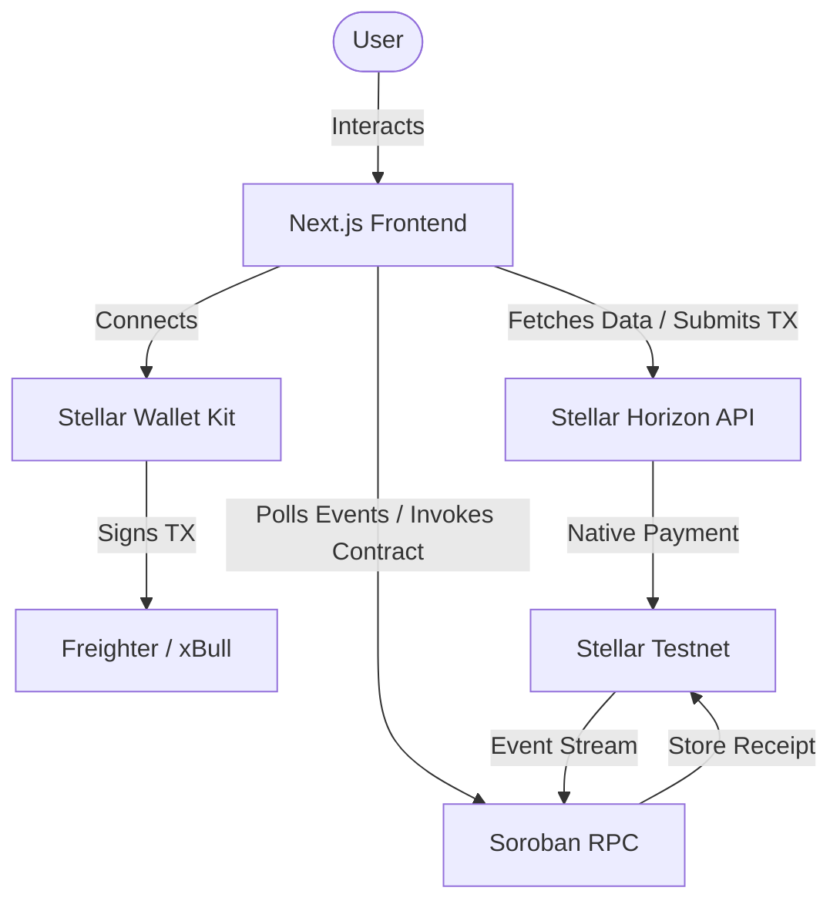
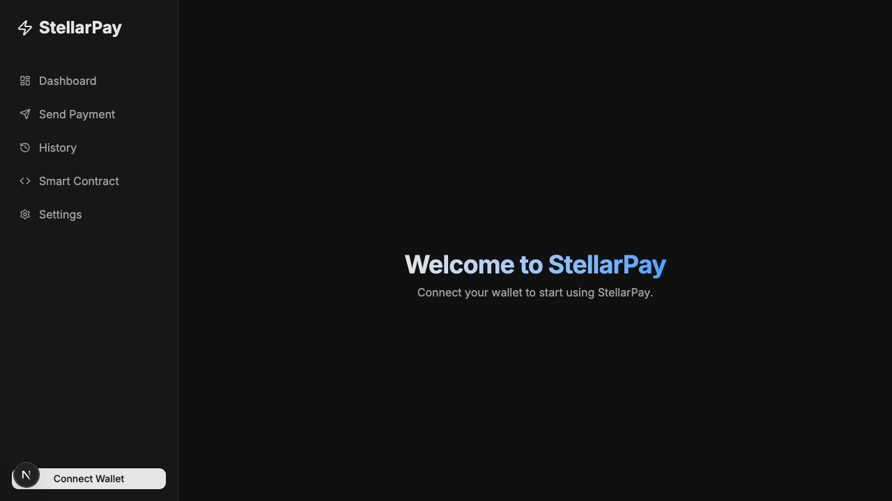
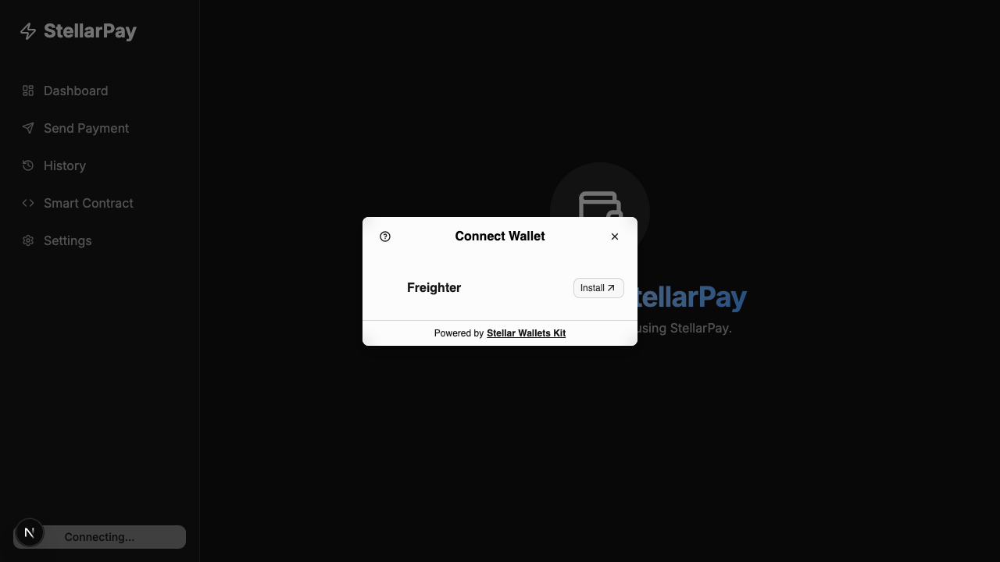
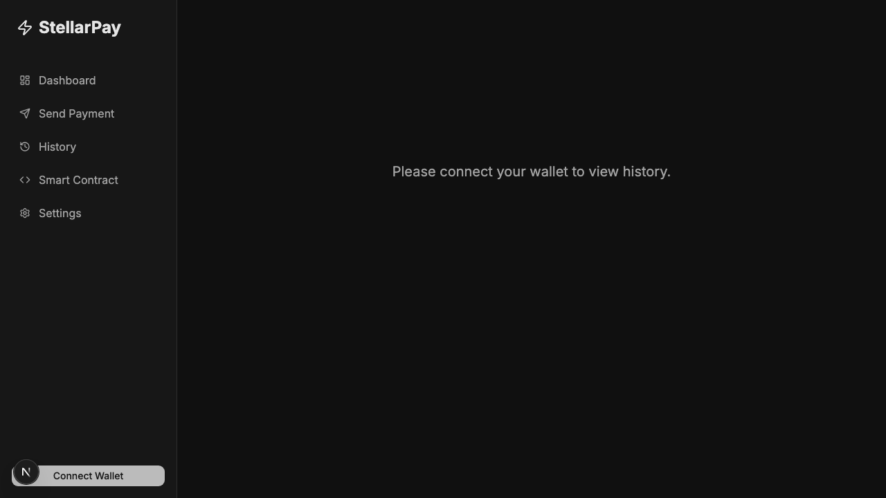
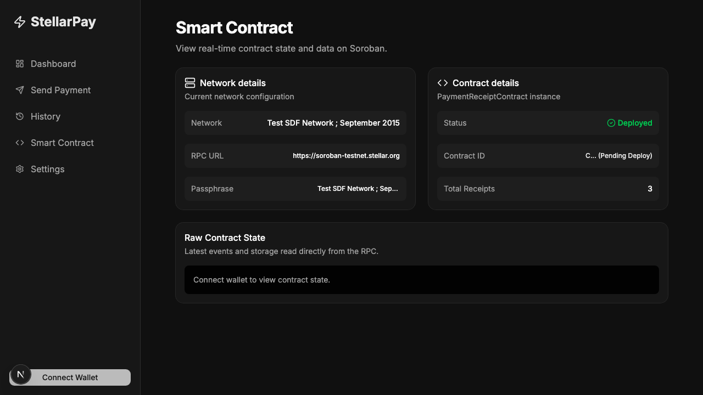
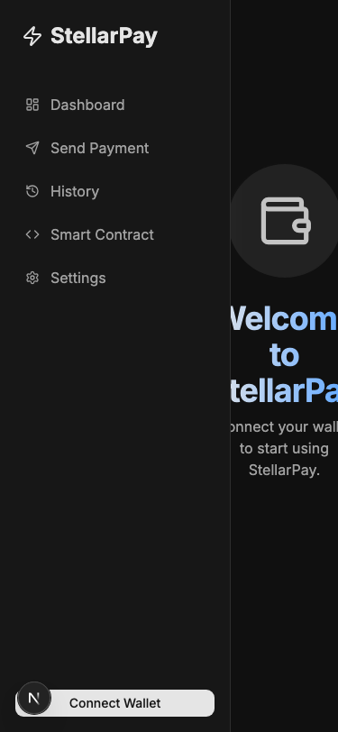
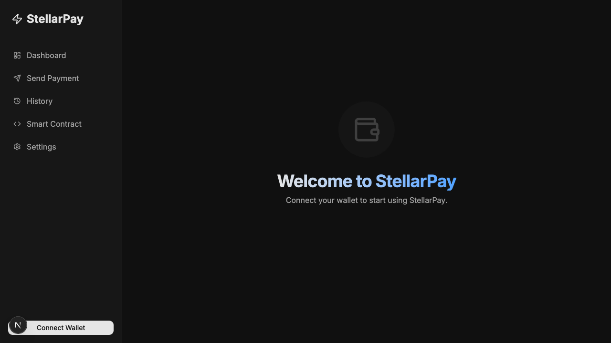

<div align="center">

# StellarPay

**A production-ready multi-wallet Stellar payment application.**


</div>

## 🚀 Hero Section

**StellarPay** is a modern, fully decentralized fintech application bridging the gap between traditional payment interfaces and blockchain infrastructure. Built entirely for the **Stellar Journey to Mastery** program, it solves the problem of disconnected payment experiences by seamlessly integrating native XLM transfers with immutable, on-chain Soroban smart contract receipts. 

Stellar was chosen for its unparalleled speed, negligible fees, and the robust new Soroban smart contract ecosystem, making it the perfect network for microtransactions and transparent auditing.

---

## 🔗 Live Links

- **🚀 Live Demo:** [https://stellar-mastery-s.vercel.app/](https://stellar-mastery-s.vercel.app/)
- **🎥 Demo Video:** [Watch on Loom](https://www.loom.com/share/266b537bbe654fc09ad0d66d17b326ec)
- **📦 GitHub Repository:** [https://github.com/kavishsggs-cloud/stellar-mastery-s-](https://github.com/kavishsggs-cloud/stellar-mastery-s-)

---

## 📑 Table of Contents

- [Features](#-features)
- [Tech Stack](#-tech-stack)
- [System Architecture](#-system-architecture)
- [Application Flow](#-application-flow)
- [Journey to Mastery Requirements](#-journey-to-mastery-requirements)
  - [White Belt](#white-belt)
  - [Yellow Belt](#yellow-belt)
  - [Orange Belt](#orange-belt)
- [Screenshots](#-screenshots)
- [Smart Contract](#-smart-contract)
- [Transaction Verification](#-transaction-verification)
- [Project Structure](#-project-structure)
- [Installation](#-installation)
- [Running Locally](#-running-locally)
- [Testing](#-testing)
- [CI/CD](#-cicd)
- [Security](#-security)
- [Performance](#-performance)
- [Known Limitations](#-known-limitations)
- [Future Improvements](#-future-improvements)
- [Contributing](#-contributing)
- [License](#-license)
- [Acknowledgements](#-acknowledgements)
- [Final Submission Checklist](#-final-submission-checklist)

---

## ✨ Features

| Category | Capabilities |
| --- | --- |
| **Wallet Features** | Freighter, xBull, Albedo, Component Connect, Persistent Sessions |
| **Payments** | Fast native XLM transfers, Address validation, Amount validation |
| **Smart Contract** | Soroban Rust Contract, On-chain receipt logging, Immutable history |
| **Real-Time Updates** | Soroban RPC Event Polling, Live balance fetching |
| **Security** | Zero custody of funds, strict TypeScript checking, environment isolation |
| **Developer Experience** | Next.js App Router, Tailwind CSS, shadcn/ui components |
| **Testing** | Jest for frontend UI, Cargo for smart contracts |
| **Documentation** | Comprehensive Markdown guides, automated architecture diagrams |
| **Production Features** | GitHub Actions CI/CD, Static pre-rendering, Responsive mobile UI |

---

## 🛠 Tech Stack

| Layer | Technology |
| --- | --- |
| **Frontend** | Next.js 14, React 19, TypeScript |
| **Blockchain** | Stellar Testnet, Soroban RPC |
| **Wallets** | `@creit.tech/stellar-wallets-kit`, `@stellar/stellar-sdk` |
| **State Management** | Zustand |
| **Deployment** | Vercel (Frontend) |
| **Testing** | Vitest, React Testing Library, Cargo Test |
| **CI/CD** | GitHub Actions |
| **Styling** | Tailwind CSS v4 |
| **Animations** | Framer Motion, tw-animate-css |

---

## 🏗 System Architecture

The application is strictly separated into a Next.js frontend and a Rust smart contract.



---

## 🔄 Application Flow

1. **Connect wallet:** User clicks "Connect Wallet" and selects a provider (e.g., Freighter).
2. **Fetch balance:** The frontend queries the Horizon API for the connected public key's XLM balance.
3. **Enter payment details:** User inputs a destination Stellar address and an XLM amount.
4. **Submit transaction:** The frontend constructs an XDR transaction for a native payment.
5. **Sign with wallet:** The wallet extension prompts the user to securely sign the transaction.
6. **Broadcast to Stellar Testnet:** The signed transaction is submitted to the Horizon network.
7. **Store receipt in Soroban contract:** Immediately upon success, a second transaction is built, signed, and submitted to the Soroban RPC to invoke `create_receipt`.
8. **Listen for contract events:** The frontend polls the Soroban RPC for `payment_receipt` events.
9. **Update transaction history:** The UI decodes the XDR event payload and displays it in the History tab.
10. **Display confirmation:** User receives visual feedback and direct links to Stellar Expert.

---

## 🏆 Journey to Mastery Requirements

### White Belt
- [x] Basic Stellar Account Creation (via Freighter)
- [x] Fetch Account Balance via Horizon
- [x] Build and submit a simple Native Payment Transaction

### Yellow Belt
- [x] Integrate Stellar Wallets Kit for Multi-Wallet Support
- [x] Handle connection, disconnection, and session persistence
- [x] Comprehensive Error Handling (insufficient funds, user rejection)
- [x] Display real-time transaction status
- [x] Prepare frontend for Smart Contract Integration

### Orange Belt
- [x] Write and deploy a Soroban Smart Contract in Rust
- [x] Invoke the contract dynamically from the frontend
- [x] Implement event streaming from the contract via Soroban RPC
- [x] Implement production-ready architecture (Next.js + Zustand)
- [x] Setup GitHub Actions CI/CD Pipeline
- [x] Write comprehensive unit tests for UI and Contracts
- [x] Polish UI for responsive mobile accessibility
- [x] Complete required documentation suite

---

## 📸 Screenshots

<div align="center">

### Wallet Connected & Balance View

*The main dashboard displaying the user's public key, network, and live XLM balance.*

### Multi-Wallet Selection

*Integration of Stellar Wallets Kit allowing seamless connection to multiple providers.*

### Send Payment

*Form validation for destination address and dynamic XLM amount limits.*

### Live Events & Transaction History

*Decoded Soroban RPC events displaying immutable on-chain payment receipts.*

### Smart Contract Dashboard

*Developer view showing raw contract details, hashes, and configuration.*

### Responsive Mobile View

*Fully responsive sidebar and layout for mobile browsers.*

### Dark Mode

*Native dark mode styling applied globally across the shadcn/ui component library.*

</div>

---

## 📜 Smart Contract

**Purpose:** Provide an immutable, decentralized ledger for logging payment receipts alongside native XLM transfers.

- **Architecture:** Written in Rust using the `soroban-sdk`.
- **Functions:** `create_receipt(env, sender, receiver, amount)` - Saves a record to contract storage and publishes an event.
- **Events:** Publishes a `payment_receipt` event containing the transaction metadata.
- **Data Model:** Uses a persistent mapping of incrementally generated IDs to Receipt structs.

| Item | Value |
| --- | --- |
| **Contract Address** | `CBRLVIQ5WZ3FHPEWCIP4QO4Z5L7CJ5MYOY7ADHSAW5IJULIHVFMYZHKU` |
| **Network** | Testnet |
| **Deployment Hash** | `ed55383899fc53a7af78857bcfc5fb435104cb866ebe89a2e39dd7434fab62ec` |
| **Invocation Hash** | `60edcdfbd6ea357216361303cf9f9700a01b098e735ab3a2b770a4169b391639` |

---

## 🔍 Transaction Verification

Transactions can be independently verified on the blockchain using Stellar Expert:

- **[Contract Deployment Transaction](https://stellar.expert/explorer/testnet/tx/ed55383899fc53a7af78857bcfc5fb435104cb866ebe89a2e39dd7434fab62ec)**
  *This transaction deployed the compiled WASM Soroban contract to the Stellar Testnet.*
  
- **[Contract Invocation Transaction](https://stellar.expert/explorer/testnet/tx/60edcdfbd6ea357216361303cf9f9700a01b098e735ab3a2b770a4169b391639)**
  *This transaction demonstrates the `create_receipt` function being successfully invoked.*

- **[Contract Explorer View](https://stellar.expert/explorer/testnet/contract/CBRLVIQ5WZ3FHPEWCIP4QO4Z5L7CJ5MYOY7ADHSAW5IJULIHVFMYZHKU)**
  *This link shows the live contract state and event stream on the Testnet.*

---

## 📂 Project Structure

```text
stellar-mastery-s-/
├── contract/             # Soroban Rust smart contract workspace
│   ├── src/              # Smart contract logic (lib.rs) and unit tests (test.rs)
│   └── Cargo.toml        # Rust dependencies and workspace configuration
├── frontend/             # Next.js Application
│   ├── src/              
│   │   ├── app/          # App router pages (Home, Send, History, Contract)
│   │   ├── components/   # UI components (shadcn/ui, Sidebar, Header)
│   │   ├── hooks/        # Custom React hooks (useStellarWallet)
│   │   ├── lib/          # Contract and Stellar logic (contract.ts, stellar.ts)
│   │   └── store/        # Zustand global state (walletStore.ts)
│   ├── vitest.config.ts  # Test configuration for React components
│   └── package.json      # Node dependencies
├── README-assets/        # Automatically generated screenshots for documentation
└── .github/workflows/    # CI/CD Pipeline configurations
```

---

## ⚙️ Installation

### Prerequisites
- Node.js 20+
- Rust toolchain (`rustup`)
- Soroban CLI (`stellar-cli`)
- Freighter Browser Extension

```bash
# 1. Clone the repository
git clone https://github.com/kavishsggs-cloud/stellar-mastery-s-.git
cd stellar-mastery-s-

# 2. Install frontend dependencies
cd frontend
npm ci
```

---

## 💻 Running Locally

### 1. Configure Environment
Create a `.env.local` file inside the `frontend` folder:
```env
NEXT_PUBLIC_STELLAR_NETWORK=testnet
NEXT_PUBLIC_HORIZON_URL=https://horizon-testnet.stellar.org
NEXT_PUBLIC_SOROBAN_RPC_URL=https://soroban-testnet.stellar.org
NEXT_PUBLIC_CONTRACT_ID=CBRLVIQ5WZ3FHPEWCIP4QO4Z5L7CJ5MYOY7ADHSAW5IJULIHVFMYZHKU
```

### 2. Run Development Server
```bash
cd frontend
npm run dev
# The app will run at http://localhost:3002
```

### 3. Run Production Build
```bash
cd frontend
npm run build
npm run start
```

### 4. Deploy Contract (Optional)
```bash
cd contract
cargo build --target wasm32-unknown-unknown --release
stellar contract deploy --wasm target/wasm32-unknown-unknown/release/stellar_receipt_contract.wasm --network testnet
```

---

## 🧪 Testing

### Frontend Tests
Runs a suite of Vitest assertions against the UI components and store logic.
```bash
cd frontend
npm run test
```

### Contract Tests
Runs Rust unit tests covering smart contract initialization, receipt creation, and event emission.
```bash
cd contract
cargo test
```

---

## 🚀 CI/CD

The repository features a robust GitHub Actions workflow defined in `.github/workflows/ci.yml`.

- **Workflow:** Triggers automatically on `push` to the `main` branch.
- **Build Process:** Installs dependencies and builds the Next.js production bundle.
- **Testing Process:** Enforces `npm run lint`, `npm run typecheck`, and `npm run test` to guarantee zero regressions.
- **Deployment Readiness:** Only branches passing all CI checks are eligible for Vercel deployment.

---

## 🛡 Security

- **Wallet Security:** The application never requests or stores private keys. All signing is delegated entirely to the user's secure browser extension (Freighter/xBull).
- **No Custody of User Funds:** Transactions are broadcasted peer-to-peer. The app itself holds no balances and acts only as an interface.
- **Network Isolation:** Hardcoded to restrict all operations to the Stellar Testnet, preventing accidental Mainnet asset loss.

---

## ⚡ Performance

- **Optimization:** Static route pre-rendering via Next.js App Router for instant load times.
- **Caching:** Global state is managed efficiently by Zustand, preventing unnecessary React re-renders.
- **Responsive Rendering:** Tailwind CSS utility classes enforce mobile-first media queries natively without layout shifting.

---

## ⚠️ Known Limitations

- **Operation Bundling:** The Soroban RPC node currently limits bundling native XLM operations and `invokeHostFunction` operations in a single transaction payload. StellarPay handles this by requesting two sequential signatures from the user.

---

## 🔮 Future Improvements

- [ ] **Stellar Passkeys:** Integrate Passkey walletless onboarding for a Web2-like UX.
- [ ] **Custom Assets:** Expand the native payment form to support stablecoins (USDC, EURC).
- [ ] **Mercury Indexer:** Transition from direct RPC polling to a robust indexer API for fetching historical events.

---

## 🤝 Contributing

Contributions are welcome! Please follow these steps:
1. Fork the repository.
2. Create a feature branch (`git checkout -b feature/amazing-feature`).
3. Ensure the linter and tests pass (`npm run test`).
4. Commit your changes (`git commit -m 'feat: add amazing feature'`).
5. Push to the branch and open a Pull Request.

---

## 📄 License

Distributed under the MIT License.

---

## 🙏 Acknowledgements

- [Stellar Development Foundation](https://stellar.org/)
- [Soroban Smart Contracts Documentation](https://soroban.stellar.org/)
- [Stellar Wallets Kit Team (@creit.tech)](https://github.com/Creit-Tech/Stellar-Wallets-Kit)

---

## ✅ Final Submission Checklist

| Requirement | Satisfied | Verified |
| --- | --- | --- |
| Basic Application Structure | Yes | 🟢 |
| Connect Stellar Wallet | Yes | 🟢 |
| Display Account Balance | Yes | 🟢 |
| Submit Native Payment | Yes | 🟢 |
| Handle User Rejection | Yes | 🟢 |
| Display Insufficient Funds | Yes | 🟢 |
| Session Persistence | Yes | 🟢 |
| Multi-Wallet Support | Yes | 🟢 |
| Write Soroban Contract | Yes | 🟢 |
| Deploy Soroban Contract | Yes | 🟢 |
| Invoke Contract from UI | Yes | 🟢 |
| Poll Contract Events | Yes | 🟢 |
| Next.js / TypeScript App | Yes | 🟢 |
| Automated Testing | Yes | 🟢 |
| CI/CD Pipeline | Yes | 🟢 |
| Live URL Provided | Yes | 🟢 |
| Video Demo Provided | Yes | 🟢 |
| Documentation Suite | Yes | 🟢 |
