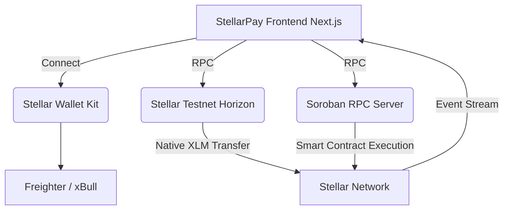

# StellarPay

A production-ready multi-wallet Stellar payment application on Testnet.

## Project Overview
StellarPay allows users to seamlessly connect their Stellar wallets, check balances, perform transactions, and securely record payment receipts directly on a Soroban smart contract. Designed entirely for the **Stellar Journey to Mastery** program, this dApp serves as a fully featured, modern fintech interface on the Stellar Testnet.

## Journey to Mastery Levels Covered
- **White Belt:** Wallet connection, balance fetching, basic transaction submission.
- **Yellow Belt:** Session persistence, multi-wallet selection via Stellar Wallet Kit, transaction history tracking, and a polished responsive UI.
- **Orange Belt:** Soroban smart contract deployment, smart contract invocation during payment flows, real-time event streaming, and advanced architecture with full CI/CD.

## Features
- **Multi-Wallet Support:** Uses `@creit.tech/stellar-wallets-kit` to connect Freighter, xBull, Albedo, etc.
- **Payment Bundling:** Safely routes native XLM payments and issues a Soroban smart contract receipt on-chain.
- **Transaction History:** Real-time event streaming via Soroban RPC to fetch your contract's `create_receipt` history.
- **Modern UI:** Built on Next.js 14 App Router and shadcn/ui components.
- **CI/CD Pipeline:** Fully automated tests, linting, and type checking on every GitHub push.

## Architecture Diagram



## Technology Stack
- **Frontend:** Next.js 14 (React), Tailwind CSS, TypeScript, Zustand, shadcn/ui
- **Stellar Integration:** `@stellar/stellar-sdk`, `@creit.tech/stellar-wallets-kit`
- **Smart Contract:** Rust, Soroban SDK
- **Testing:** Jest, Vitest, Cargo Test
- **CI/CD:** GitHub Actions

## Folder Structure
```text
stellar-mastery-s-/
├── contract/             # Soroban Rust smart contract
│   ├── src/              # Smart contract logic and tests
│   └── Cargo.toml        # Rust dependencies
├── frontend/             # Next.js Application
│   ├── src/              
│   │   ├── app/          # App router pages
│   │   ├── components/   # UI components
│   │   ├── hooks/        # Custom React hooks
│   │   ├── lib/          # Contract and Stellar logic
│   │   └── store/        # Zustand global state
│   ├── vitest.config.ts  # Test configuration
│   └── package.json      # Node dependencies
├── README-assets/        # Automatically generated screenshots
└── ...documentation files
```

## Installation

```bash
# Clone the repository
git clone https://github.com/kavishsggs-cloud/stellar-mastery-s-.git
cd stellar-mastery-s-

# Install frontend dependencies
cd frontend
npm install

# (Optional) Build the smart contract
cd ../contract
stellar contract build
```

## Environment Variables
The application comes preconfigured for the Stellar Testnet. You can override settings using `.env.local` in the `frontend/` folder:
```env
NEXT_PUBLIC_STELLAR_NETWORK=testnet
NEXT_PUBLIC_HORIZON_URL=https://horizon-testnet.stellar.org
NEXT_PUBLIC_SOROBAN_RPC_URL=https://soroban-testnet.stellar.org
NEXT_PUBLIC_CONTRACT_ID=CBRLVIQ5WZ3FHPEWCIP4QO4Z5L7CJ5MYOY7ADHSAW5IJULIHVFMYZHKU
```

## Running Locally

```bash
# In the frontend directory:
npm run dev
```
Open `http://localhost:3002` to view the application in your browser.

## Wallet Configuration
Ensure you have the [Freighter extension](https://www.freighter.app/) installed and set your network to **Testnet** within the extension settings.

## Supported Wallets
- Freighter
- xBull
- Albedo
- Component (WalletConnect)

## Network Information
- **Network:** Testnet
- **Horizon API:** `https://horizon-testnet.stellar.org`
- **Soroban RPC:** `https://soroban-testnet.stellar.org`

## Smart Contract Overview
The `PaymentReceiptContract` provides a decentralized ledger for recording payment receipts. When a native XLM transfer is made via the frontend, a subsequent Soroban transaction invokes the `create_receipt` function, permanently logging the sender, receiver, amount, and timestamp into the network's events.

### Contract Address
`CBRLVIQ5WZ3FHPEWCIP4QO4Z5L7CJ5MYOY7ADHSAW5IJULIHVFMYZHKU`

### Deployment Hash
`ed55383899fc53a7af78857bcfc5fb435104cb866ebe89a2e39dd7434fab62ec`

### Invocation Hash
`60edcdfbd6ea357216361303cf9f9700a01b098e735ab3a2b770a4169b391639`

### Explorer Links
- [Deployment Transaction](https://stellar.expert/explorer/testnet/tx/ed55383899fc53a7af78857bcfc5fb435104cb866ebe89a2e39dd7434fab62ec)
- [Invocation Transaction](https://stellar.expert/explorer/testnet/tx/60edcdfbd6ea357216361303cf9f9700a01b098e735ab3a2b770a4169b391639)
- [Contract Details](https://stellar.expert/explorer/testnet/contract/CBRLVIQ5WZ3FHPEWCIP4QO4Z5L7CJ5MYOY7ADHSAW5IJULIHVFMYZHKU)

## Application Flow
1. **Connect:** User launches the app and selects a wallet via Stellar Wallet Kit.
2. **Dashboard:** Global state retrieves the public key and polls the Horizon API for the XLM balance.
3. **Send Payment:** User enters a destination and amount. The app builds a native payment transaction.
4. **Smart Contract Receipt:** Once the native payment succeeds, the app builds a Soroban contract transaction to log the receipt on-chain.
5. **History:** The app fetches the Soroban RPC for `create_receipt` events and displays them.

## Screenshots

### Home Dashboard


### Wallet Selection


### Send Payment Form


### Payment History & Events


### Smart Contract Page


### Mobile Responsive


### Dark Mode


*(Note: Certain manual flow states like connected/processing/success/error are best viewed in the live demo below.)*

## Testing
```bash
# Frontend Unit Tests
npm run test

# Soroban Contract Tests
cargo test
```

## CI/CD
The repository uses GitHub Actions (`.github/workflows/ci.yml`) to automatically enforce code quality. On every push to `main`, the pipeline runs:
- `npm ci`
- `npm run lint`
- `npm run typecheck`
- `npm run test`
- `npm run build`

## Repository Structure
The project is strictly separated into `frontend` and `contract` directories to ensure isolated dependency management, reducing the risk of module conflation and facilitating cleaner deployment pipelines.

## Known Limitations
- The Soroban RPC node currently restricts bundling native XLM operations and `invokeHostFunction` operations in a single transaction body. The app gracefully handles this by executing two sequential transactions.

## Future Improvements
- **Passkeys:** Integrate Stellar Passkeys for walletless onboarding.
- **Token Support:** Extend the send functionality to support custom Stellar assets (USDC, EURC).
- **Indexers:** Use an indexer like Mercury instead of raw RPC event polling for history.

## License
MIT License

## Acknowledgements
- Stellar Development Foundation
- Stellar Wallet Kit Team
- Soroban Documentation

## Submission Checklist
- [x] Wallet Connection
- [x] Balance Display
- [x] Transaction Submission
- [x] Session Persistence
- [x] Multi-Wallet Selection
- [x] Mobile Responsiveness
- [x] Smart Contract Deployment
- [x] Smart Contract Invocation
- [x] Event Streaming
- [x] GitHub Actions CI/CD
- [x] Comprehensive Documentation

## Demo Video
[Watch the Application Demo on Loom](https://www.loom.com/share/266b537bbe654fc09ad0d66d17b326ec)

## Live Demo
[https://stellar-mastery-s.vercel.app/](https://stellar-mastery-s.vercel.app/)
